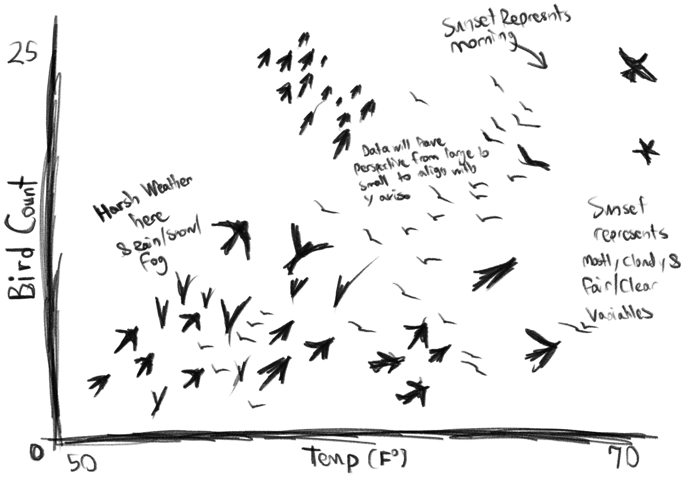
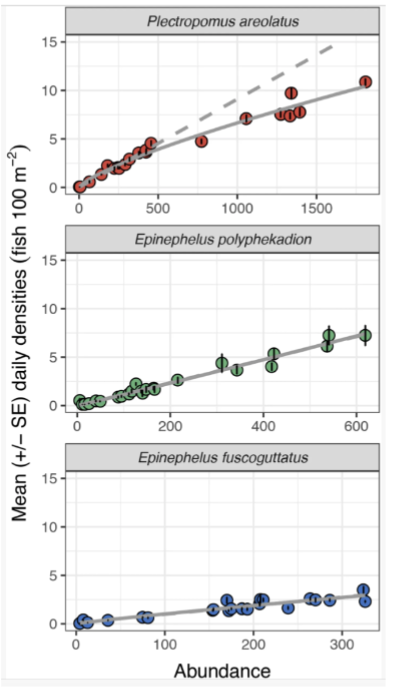

# Setup

```{r}

suppressPackageStartupMessages(library(tidyverse))

suppressPackageStartupMessages(library(here))

suppressPackageStartupMessages(library(readxl))

suppressPackageStartupMessages(library(janitor))

kelp <- read_csv(here("data", "temp-kelp.csv"), show_col_types = FALSE)

bird <- read_csv(here("data", "bird_weather_observations.csv"), show_col_types = FALSE)

```

# Problem 1. Giant kelp fronds

## 1a

To evaluate the relationship between ocean temperature and giant kelp frond elongation rate, I would use both Pearson correlation and simple linear regression. Pearson correlation measures the strength and direction of a linear relationship between two continuous variables, while simple linear regression models how kelp growth rate changes as a function of temperature and provides an interpretable slope.

## 1b

```{r}

# ggplot will give us our default plot using kelp
# object and then aes will help us specify the
# x-axis and y-axis of interest.
ggplot(kelp, aes(x = temp_c, y = kelp_elong)) +
  # geom_point will create the actual
  # scatter plot, and we can use steelblue as the
  # color and alpha to reduce opacity.
  geom_point(color = "steelblue", alpha = 0.7) +
  # This lets us rename our x-axis and y-axis to
  # something much cleaner.
  labs(
    x = "Ocean temperature (°C)",
    y = "Kelp frond elongation rate (cm/day)",
    # title allows us to name title.
    title = "Relationship between temperature and kelp growth"
  ) +
  # Nothing more than a theme that I found to be
  # pleasing to the eyes.
  theme_minimal()

```

## 1c

### Check assumptions

```{r}

# Fit simple linear regression model.
kelp_lm <- lm(kelp_elong ~ temp_c, data = kelp)

# Diagnostic plots for assumptions.
par(mfrow = c(2, 2))
plot(kelp_lm)

```

The assumptions of simple linear regression that were checked include linearity, normality of residuals, and homoscedasticity. These were assessed using diagnostic plots from the linear model, including residuals vs fitted values and Q-Q plots. The scatterplot from Part 1b also suggested an approximately linear, negative relationship between temperature and kelp growth, although there was noticeable scatter around the trend.

### Run statistical tests

```{r}

# Fit simple linear regression model.
kelp_lm <- lm(kelp_elong ~ temp_c, data = kelp)

# View model summary.
summary(kelp_lm)

```

## 1d

To evaluate the relationship between ocean temperature and giant kelp frond elongation rate, I used a simple linear regression model because the method quantifies the strength and direction of a relationship between two continuous variables.

A simple linear regression was calculated to predict kelp frond elongation rate (cm/day) based on ocean temperature (°C). A significant regression equation was found, (F(1, 30) = 26.93, p \< 0.001, $\alpha$ = 0.05), with an $R^2$ = 0.473. Kelp frond elongation rate is equal to 14.09 − 0.43(x). Temperature was a significant predictor of kelp frond elongation rate ($\beta$ = -0.432, p \< 0.001, $\alpha$ = 0.05).

## 1e

These results suggest that increasing ocean temperature is associated with reduced giant kelp frond elongation rates (negative correlation). For a team working on kelp forest conservation and management, these findings suggest that continued ocean warming could reduce kelp productivity and potentially impact species that depend on kelp habitats.

## 1f

```{r}

# Pearson correlation test (alternative test)
cor.test(kelp$temp_c, kelp$kelp_elong)

```

The Pearson correlation showed a significant negative relationship between temperature and kelp growth (r = -0.688, p \< 0.001, 95% CI \[-0.836, -0.446\], $\alpha$ = 0.05). This result is consistent with the simple linear regression analysis, which also indicated a significant negative relationship between temperature and kelp frond elongation rate. Both tests lead to the same conclusions where when ocean temperature increases, kelp frond elongation rate decreases, and the relationship is statistically significant in both approaches.

# Problem 2. Personal data

## 2a

### Data cleanup

```{r}

# This troubleshooting code below was used to
# change an error in my variable "Condition"
# where one of the variables was spelled wrong
# and became a new category.
bird$Condition <- gsub("MosltyCloudy", "MostlyCloudy", bird$Condition)
bird$Condition <- as.factor(bird$Condition)

bird_clean <- bird |>
  drop_na(BigBird, SmallBird, Condition, Temp_F)

```

```{r}

# This will give us base layer and define our
# x-axis and our y-axis.
# This step will also use our clean bird data.
ggplot(bird_clean, aes(x = Condition, y = BigBird)) +
  # geom_boxplot will give us a box plot, which
  # is ideal given we have seven categorical 
  # variables.
  # Light blue was chosen cause it looks like a
  # cloudy-ish color.
  geom_boxplot(fill = "lightblue") +
  # geom_jitter allows us to represent our
  # observations through jittered points.
  geom_jitter(width = 0.2, alpha = 0.5, height = 0) +
  # labs will allow us to rename our title,
  # x-axis, and y axis.
  labs(
    title = "Large bird abundance across weather conditions in Isla Vista",
    x = "Weather condition",
    y = "Number of large birds"
  ) +
  # Although I prefer theme_minimal, theme_bw
  # was chosen to reduce redundancy.
  theme_bw() +
  # theme is being used to adjust minor spacing 
  # and put our x-axis variables at an angle in
  # order to fit the labels.
  theme(axis.text.x = element_text(angle = 45, hjust = 1))

```

```{r}

# This will select our clean bird data, and
# select appropriate columns for our x-axis and
# our y-axis.
ggplot(bird_clean, aes(x = Temp_F, y = SmallBird)) +
  # geom_point inserts our data as a scatter
  # plot to plot out small bird points.
  geom_point(color = "darkblue", alpha = 0.6) +
  # labs is used to rename our x-axis and y-axis
  # to something more appropriate.
  labs(
    title = "Effect of temperature on small bird abundance in Isla Vista",
    x = "Temperature (°F)",
    y = "Number of small birds"
  ) +
  # theme_bw selected to remain consistent with
  # it's paired figure above.
  theme_bw()

```

## 2b

**Figure 1.** Large bird abundance across different weather conditions in Isla Vista. The figure shows variation in large bird counts across conditions such as Fair, Cloudy, Mist, Rain, Fog, and Smoke. Each box represents the distribution of bird counts for a given weather condition, where the center line is the median, the box represents the interquartile range (25th to 75th percentile), and the whiskers show the range of the data excluding outliers. Individual points represent raw observations from each sampling day. Overall, large bird abundance appears to vary by condition where we see a potential increase in large bird abundance in mostly cloudy weather and fair weather and a decrease in large bird abundance in misty and cloudy weather, although some categories (such as Rain and Fog) have low sample sizes, which may limit comparison across groups.

**Figure 2.** Relationship between temperature (°F) and small bird abundance in Isla Vista. Each point represents a single observation (one sampling event on a given day), showing the recorded temperature and corresponding number of small birds observed during that sampling period. The scatter plot shows a general pattern between increasing temperature and increases in small bird counts, suggesting a potential relationship between temperature and small bird abundance, although there is noticeable variability in the data.

# Problem 3. Affective visualization

## 3a

```{r}

library(tidyverse)

ggplot() +

  # Small birds
  geom_point(
    data = bird,
    aes(x = Temp_F, y = SmallBird),
    color = "blue",
    size = 3,
    alpha = 0.7
  ) +

  # Big birds
  geom_point(
    data = bird,
    aes(x = Temp_F, y = BigBird),
    color = "red",
    size = 3,
    alpha = 0.7
  ) +

  labs(
    title = "Bird abundance across temperatures",
    subtitle = "Blue = small birds, Red = large birds",
    x = "Temperature (°F)",
    y = "Bird count"
  ) +

  theme_minimal()
```

An affective visualization of my bird survey data could depict individual bird observations as birds flying away from a dark, smoky, rainy center toward brighter and warmer conditions at the edge of the image. Different weather conditions would be represented through colors and textures rather than traditional axes, while large and small birds would be shown using different silhouettes. The number of birds in each region would correspond to the abundance observed during surveys, creating denser flocks on days with higher bird activity.

## 3b



## 3c


## 3d

My piece shows bird observations collected during field surveys in Isla Vista, using large and small bird abundance across different temperatures. I was influenced by Jill Pelto's artwork, which combines scientific data with artistic visuals to communicate environmental information. My work is a digital visualization created in R and then modified as an artistic sketch. I created it by plotting my bird survey data and then redesigning the graph to emphasize atmosphere, color, and the relationship between weather conditions and bird activity.

## 3e

\[View Google Slides\](https://docs.google.com/presentation/d/1Py_tZungdfwa2j16yptvBFdn_NkbFC24tl2svlfJKzA/edit?usp=sharing)

# Problem 4. Statistical critique

## 4a



The authors use generalized linear mixed-effects models (GLMMs) with a Poisson error distribution and log link to test whether grouper abundance changed over time across survey years. They treat daily fish counts as repeated measures across months and years, allowing them to model variation while accounting for non-independence in the sampling design. Pairwise comparisons between years are conducted using z-tests through the emmeans package in R. These tests are used to evaluate whether observed changes in abundance across 2009, 2014, and 2019 are statistically significant.

## 4b

The figure shows the relationship between total abundance (x-axis) and mean daily density with standard error (y-axis) for three grouper species, with each species shown in a separate panel. Individual raw data points are included and color-coded (red, green, blue), which helps make the underlying data structure visible. The axes are logically arranged and the positive relationships are easy to interpret across all three species. However, overlapping large point sizes obscure some data points, which slightly reduces clarity in denser regions.

## 4c

The figure is relatively clean, with clear separation between species and minimal unnecessary visual elements. The main issue is overplotting caused by large point sizes, which hides some data points and reduces readability in higher-density areas. The color scheme is effective for distinguishing species, but having all three species represented in this way is slightly distracting and intimidating to read at first glance. Also, on the x-axis the maximum abundance of all three species varies, meaning a direct side-by-side comparison could be considered misleading. Overall, the design is strong but would benefit from reducing point size to improve transparency, along with minor reformatting.

## 4d

I would recommend reducing the point size and adding transparency to reduce overplotting and make individual observations easier to distinguish. I would also standardize the x-axis range across all three species so that differences in abundance are visually comparable rather than potentially misleading due to scaling. To reduce visual intimidation, the figure could benefit from simplifying the color emphasis or improving spacing between panels so the viewer can focus on one species at a time. These changes would improve interpretability while still preserving the key statistical relationships shown in the data.
